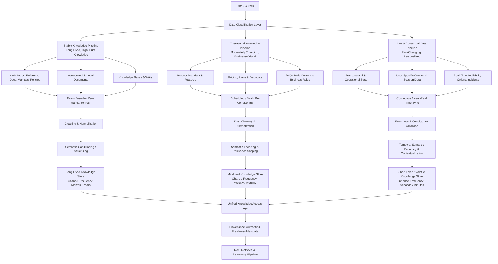

```mermaid
graph TD

%% =========================
%% RAG DATA INGESTION PIPELINE (GitHub Compatible)
%% =========================

SRC[Data Sources] --> CL[Data Classification Layer]

%% =========================
%% DATA TYPE SEGMENTATION
%% =========================
CL --> ST1[Stable Knowledge Pipeline<br>Long-Lived, High-Trust Knowledge]
CL --> ST2[Operational Knowledge Pipeline<br>Moderately Changing, Business-Critical]
CL --> ST3[Live & Contextual Data Pipeline<br>Fast-Changing, Personalized]

%% =========================
%% 1. STABLE KNOWLEDGE PIPELINE
%% =========================
ST1 --> WP[Web Pages, Reference Docs, Manuals, Policies]
ST1 --> DOC[Instructional & Legal Documents]
ST1 --> KB[Knowledge Bases & Wikis]

WP & DOC & KB --> SCHED1[Event-Based or Rare Manual Refresh]
SCHED1 --> CLEAN1[Cleaning & Normalization]
CLEAN1 --> SEM1[Semantic Conditioning / Structuring]
SEM1 --> STORE1[Long-Lived Knowledge Store<br>Change Frequency: Months / Years]

%% =========================
%% 2. OPERATIONAL KNOWLEDGE PIPELINE
%% =========================
ST2 --> PROD[Product Metadata & Features]
ST2 --> PRICE[Pricing, Plans & Discounts]
ST2 --> FAQ[FAQs, Help Content & Business Rules]

PROD & PRICE & FAQ --> SCHED2[Scheduled / Batch Re-Conditioning]
SCHED2 --> CLEAN2[Data Cleaning & Normalization]
CLEAN2 --> SEM2[Semantic Encoding & Relevance Shaping]
SEM2 --> STORE2[Mid-Lived Knowledge Store<br>Change Frequency: Weekly / Monthly]

%% =========================
%% 3. LIVE & CONTEXTUAL DATA PIPELINE
%% =========================
ST3 --> TRANS[Transactional & Operational State]
ST3 --> USER[User-Specific Context & Session Data]
ST3 --> LIVE[Real-Time Availability, Orders, Incidents]

TRANS & USER & LIVE --> SCHED3[Continuous / Near-Real-Time Sync]
SCHED3 --> VALID3[Freshness & Consistency Validation]
VALID3 --> SEM3[Temporal Semantic Encoding & Contextualization]
SEM3 --> STORE3[Short-Lived / Volatile Knowledge Store<br>Change Frequency: Seconds / Minutes]

%% =========================
%% UNIFIED KNOWLEDGE ACCESS
%% =========================
STORE1 --> UQA[Unified Knowledge Access Layer]
STORE2 --> UQA
STORE3 --> UQA

UQA --> META[Provenance, Authority & Freshness Metadata]
META --> RAG[RAG Retrieval & Reasoning Pipeline]


```