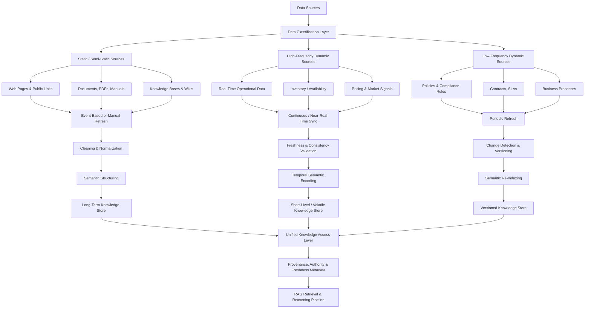

```mermaid
graph TD

%% =========================
%% RAG DATA INGESTION PIPELINE
%% =========================

SRC[Data Sources] --> CL[Data Classification Layer]

%% =========================
%% DATA TYPE SEGMENTATION
%% =========================
CL --> ST1[Static / Semi-Static Sources]
CL --> ST2[High-Frequency Dynamic Sources]
CL --> ST3[Low-Frequency Dynamic Sources]

%% =========================
%% 1. STATIC / SEMI-STATIC DATA
%% =========================
ST1 --> WP[Web Pages & Public Links]
ST1 --> DOC[Documents, PDFs, Manuals]
ST1 --> KB[Knowledge Bases & Wikis]

WP --> SCHED1[Event-Based or Manual Refresh]
DOC --> SCHED1
KB --> SCHED1

SCHED1 --> CLEAN1[Cleaning & Normalization]
CLEAN1 --> SEM1[Semantic Structuring]
SEM1 --> STORE1[Long-Term Knowledge Store]

%% =========================
%% 2. HIGH-FREQUENCY DYNAMIC DATA
%% =========================
ST2 --> RT[Real-Time Operational Data]
ST2 --> INV[Inventory / Availability]
ST2 --> PRICE[Pricing & Market Signals]

RT --> SCHED2[Continuous / Near-Real-Time Sync]
INV --> SCHED2
PRICE --> SCHED2

SCHED2 --> VALID2[Freshness & Consistency Validation]
VALID2 --> SEM2[Temporal Semantic Encoding]
SEM2 --> STORE2[Short-Lived / Volatile Knowledge Store]

%% =========================
%% 3. LOW-FREQUENCY DYNAMIC DATA
%% =========================
ST3 --> POL[Policies & Compliance Rules]
ST3 --> SLA[Contracts, SLAs]
ST3 --> PROC[Business Processes]

POL --> SCHED3[Periodic Refresh]
SLA --> SCHED3
PROC --> SCHED3

SCHED3 --> DIFF3[Change Detection & Versioning]
DIFF3 --> SEM3[Semantic Re-Indexing]
SEM3 --> STORE3[Versioned Knowledge Store]

%% =========================
%% UNIFIED KNOWLEDGE ACCESS
%% =========================
STORE1 --> UQA[Unified Knowledge Access Layer]
STORE2 --> UQA
STORE3 --> UQA

UQA --> META[Provenance, Authority & Freshness Metadata]
META --> RAG[RAG Retrieval & Reasoning Pipeline]


```