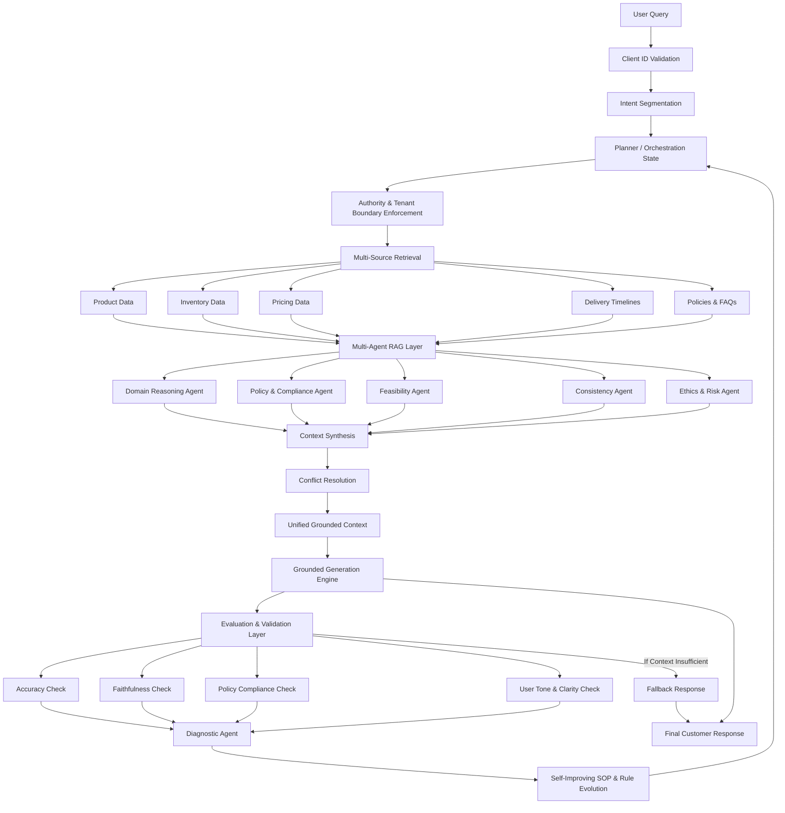

```mermaid

graph LR

%% =========================
%% USER INPUT
%% =========================
UQ[User Query]
CID[Client ID]

UQ --> PA
CID --> PA

%% =========================
%% PLANNER
%% =========================
PA[Planner Agent State<br/>Intent Detection and Scope Control]

PA --> TB[Tenant Boundary Enforcement]

%% =========================
%% DATA INGESTION
%% =========================
OS[Open Source Knowledge]
IDB[Client Internal Databases]
API[Live Business Records]

OS --> PP
IDB --> PP
API --> PP

%% =========================
%% PRE PROCESSING
%% =========================
PP[Pre Processing and Conditioning<br/>Cleaning Normalization Chunking]

PP --> VDB[Vector Database<br/>Client Scoped Embeddings]

%% =========================
%% RETRIEVAL
%% =========================
TB --> RET[Context Retrieval Engine]
VDB --> RET

RET --> MA

%% =========================
%% MULTI AGENT RAG
%% =========================
MA[Multi Agent RAG Layer]

MA --> A1[Domain Agent]
MA --> A2[Inventory Agent]
MA --> A3[Pricing Agent]
MA --> A4[Policy and Compliance Agent]
MA --> A5[Consistency Agent]

A1 --> CS
A2 --> CS
A3 --> CS
A4 --> CS
A5 --> CS

%% =========================
%% SYNTHESIS
%% =========================
CS[Context Synthesis Layer<br/>Merge Resolve Validate]

CS --> GEN

%% =========================
%% GENERATION
%% =========================
GEN[Grounded Answer Generation<br/>Context Only]

GEN --> EV

%% =========================
%% EVALUATION
%% =========================
EV[Evaluation Layer<br/>Accuracy Faithfulness Compliance]

EV --> DA[Diagnostic Agent]

%% =========================
%% SELF IMPROVEMENT
%% =========================
DA --> SOPA[SOP Architect Agent<br/>Rule Refinement]

SOPA --> PA

%% =========================
%% OUTPUT
%% =========================
GEN --> OUT[Final Customer Response]

```
---

```mermaid

graph TD
    UQ[User Query] --> CI[Client ID Validation]
    CI --> IS[Intent Segmentation]

    IS --> PL[Planner / Orchestration State]

    PL --> AE[Authority & Tenant Boundary Enforcement]

    AE --> MSR[Multi-Source Retrieval]
    MSR --> PD[Product Data]
    MSR --> ID[Inventory Data]
    MSR --> PR[Pricing Data]
    MSR --> DL[Delivery Timelines]
    MSR --> PO[Policies & FAQs]

    PD & ID & PR & DL & PO --> MA[Multi-Agent RAG Layer]

    MA --> DA[Domain Reasoning Agent]
    MA --> PA[Policy & Compliance Agent]
    MA --> FA[Feasibility Agent]
    MA --> CA[Consistency Agent]
    MA --> EA[Ethics & Risk Agent]

    DA & PA & FA & CA & EA --> CS[Context Synthesis]

    CS --> CR[Conflict Resolution]
    CR --> UF[Unified Grounded Context]

    UF --> GE[Grounded Generation Engine]

    GE --> EV[Evaluation & Validation Layer]

    EV --> AC[Accuracy Check]
    EV --> FF[Faithfulness Check]
    EV --> PC[Policy Compliance Check]
    EV --> UT[User Tone & Clarity Check]

    AC & FF & PC & UT --> DG[Diagnostic Agent]

    DG --> SOP[Self-Improving SOP & Rule Evolution]

    SOP --> PL

    EV -->|If Context Insufficient| FB[Fallback Response]
    FB --> OUT[Final Customer Response]

    GE --> OUT


```
---

```mermaid
graph LR

%% =========================
%% DATA SOURES
%% =========================
OS[Open Source Knowledge<br/>Reports and Research]
IDB[Client Internal Database<br/>Business and Policy Data]

OS --> PP
IDB --> PP

%% =========================
%% PRE PROCESSING
%% =========================
PP[Pre Processing and Conditioning<br/>Cleaning Normalization Token Reduction]

PP --> PA

%% =========================
%% PLANNER AND SOP
%% =========================
PA[Planner Agent State<br/>Intent Detection Multi Hop Planning]

PA --> SOP
SOP[Standard Operating Procedure<br/>Rules Order Constraints]

SOP --> PA

%% =========================
%% MODEL ORCHESTRATION
%% =========================
PA --> ME[Model Orchestration Engine<br/>Task Based Reasoning Allocation]

%% =========================
%% MULTI AGENT RAG
%% =========================
ME --> RAG[Multi Agent RAG Layer]

RAG --> A1[Domain Specialist Agent]
RAG --> A2[Compliance and Policy Agent]
RAG --> A3[Feasibility and Operations Agent]
RAG --> A4[Consistency Validation Agent]
RAG --> A5[Ethics and Risk Agent]

A1 --> CS
A2 --> CS
A3 --> CS
A4 --> CS
A5 --> CS

%% =========================
%% SYNTHESIS
%% =========================
CS[Criteria Synthesizer Agent<br/>Merge Deduplicate Resolve Conflicts]

CS --> GC

%% =========================
%% GENERATION
%% =========================
GC[Grounded Generation Engine<br/>Context Only Response]

GC --> EV

%% =========================
%% EVALUATION
%% =========================
EV[Multi Dimensional Evaluation<br/>Accuracy Faithfulness Compliance Feasibility Ethics]

EV --> PDOC[Performance Document]

%% =========================
%% DIAGNOSTICS
%% =========================
PDOC --> DA[Diagnostic Agent<br/>Identify Weakest Dimension]

DA --> SOPA

%% =========================
%% SELF IMPROVEMENT
%% =========================
SOPA[SOP Architect Agent<br/>Rule Mutation Planning Refinement]

SOPA --> SOP

%% =========================
%% OUTPUT
%% =========================
GC --> OUT[Final Customer Response<br/>Client Scoped Grounded Safe]


```