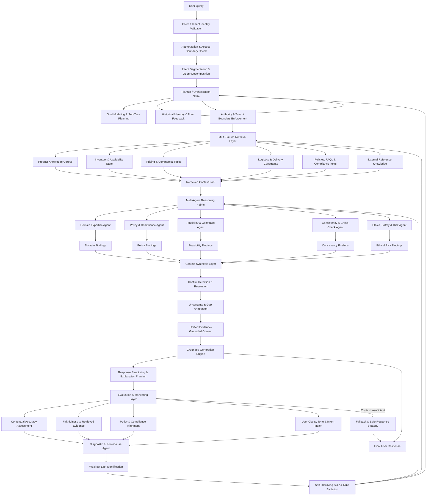

```mermaid

graph LR

%% =========================
%% USER INPUT
%% =========================
UQ[User Query]
CID[Client ID]

UQ --> PA
CID --> PA

%% =========================
%% PLANNER
%% =========================
PA[Planner Agent State<br/>Intent Detection and Scope Control]

PA --> TB[Tenant Boundary Enforcement]

%% =========================
%% DATA INGESTION
%% =========================
OS[Open Source Knowledge]
IDB[Client Internal Databases]
API[Live Business Records]

OS --> PP
IDB --> PP
API --> PP

%% =========================
%% PRE PROCESSING
%% =========================
PP[Pre Processing and Conditioning<br/>Cleaning Normalization Chunking]

PP --> VDB[Vector Database<br/>Client Scoped Embeddings]

%% =========================
%% RETRIEVAL
%% =========================
TB --> RET[Context Retrieval Engine]
VDB --> RET

RET --> MA

%% =========================
%% MULTI AGENT RAG
%% =========================
MA[Multi Agent RAG Layer]

MA --> A1[Domain Agent]
MA --> A2[Inventory Agent]
MA --> A3[Pricing Agent]
MA --> A4[Policy and Compliance Agent]
MA --> A5[Consistency Agent]

A1 --> CS
A2 --> CS
A3 --> CS
A4 --> CS
A5 --> CS

%% =========================
%% SYNTHESIS
%% =========================
CS[Context Synthesis Layer<br/>Merge Resolve Validate]

CS --> GEN

%% =========================
%% GENERATION
%% =========================
GEN[Grounded Answer Generation<br/>Context Only]

GEN --> EV

%% =========================
%% EVALUATION
%% =========================
EV[Evaluation Layer<br/>Accuracy Faithfulness Compliance]

EV --> DA[Diagnostic Agent]

%% =========================
%% SELF IMPROVEMENT
%% =========================
DA --> SOPA[SOP Architect Agent<br/>Rule Refinement]

SOPA --> PA

%% =========================
%% OUTPUT
%% =========================
GEN --> OUT[Final Customer Response]

```
---

```mermaid

graph TD

%% =========================
%% ENTRY & GOVERNANCE LAYER
%% =========================
UQ[User Query] --> CI[Client / Tenant Identity Validation]
CI --> AB[Authorization & Access Boundary Check]
AB --> IS[Intent Segmentation & Query Decomposition]

%% =========================
%% PLANNING & ORCHESTRATION
%% =========================
IS --> PL[Planner / Orchestration State]
PL --> GM[Goal Modeling & Sub-Task Planning]
PL --> HM[Historical Memory & Prior Feedback]
HM --> PL

PL --> AE[Authority & Tenant Boundary Enforcement]

%% =========================
%% MULTI-SOURCE RETRIEVAL
%% =========================
AE --> MSR[Multi-Source Retrieval Layer]

MSR --> PD[Product Knowledge Corpus]
MSR --> ID[Inventory & Availability State]
MSR --> PR[Pricing & Commercial Rules]
MSR --> DL[Logistics & Delivery Constraints]
MSR --> PO[Policies, FAQs & Compliance Texts]
MSR --> EK[External Reference Knowledge]

PD & ID & PR & DL & PO & EK --> RC[Retrieved Context Pool]

%% =========================
%% MULTI-AGENT RAG LAYER
%% =========================
RC --> MA[Multi-Agent Reasoning Fabric]

MA --> DA[Domain Expertise Agent]
MA --> PA[Policy & Compliance Agent]
MA --> FA[Feasibility & Constraint Agent]
MA --> CA[Consistency & Cross-Check Agent]
MA --> EA[Ethics, Safety & Risk Agent]

DA --> DF[Domain Findings]
PA --> PF[Policy Findings]
FA --> FF[Feasibility Findings]
CA --> CF[Consistency Findings]
EA --> EF[Ethical Risk Findings]

DF & PF & FF & CF & EF --> CS[Context Synthesis Layer]

%% =========================
%% CONTEXT SYNTHESIS
%% =========================
CS --> CR[Conflict Detection & Resolution]
CR --> UC[Uncertainty & Gap Annotation]
UC --> UF[Unified Evidence-Grounded Context]

%% =========================
%% GENERATION LAYER
%% =========================
UF --> GE[Grounded Generation Engine]
GE --> RS[Response Structuring & Explanation Framing]

%% =========================
%% EVALUATION & MONITORING
%% =========================
RS --> EV[Evaluation & Monitoring Layer]

EV --> AC[Contextual Accuracy Assessment]
EV --> FF2[Faithfulness to Retrieved Evidence]
EV --> PC[Policy & Compliance Alignment]
EV --> UT[User Clarity, Tone & Intent Match]

AC & FF2 & PC & UT --> DG[Diagnostic & Root-Cause Agent]

%% =========================
%% SELF-IMPROVEMENT LOOP
%% =========================
DG --> WL[Weakest-Link Identification]
WL --> SOP[Self-Improving SOP & Rule Evolution]
SOP --> PL
SOP --> MSR
SOP --> MA

%% =========================
%% FALLBACK & OUTPUT
%% =========================
EV -->|Context Insufficient| FB[Fallback & Safe Response Strategy]
FB --> OUT[Final User Response]

GE --> OUT


```
---

```mermaid
graph LR

%% =========================
%% DATA SOURES
%% =========================
OS[Open Source Knowledge<br/>Reports and Research]
IDB[Client Internal Database<br/>Business and Policy Data]

OS --> PP
IDB --> PP

%% =========================
%% PRE PROCESSING
%% =========================
PP[Pre Processing and Conditioning<br/>Cleaning Normalization Token Reduction]

PP --> PA

%% =========================
%% PLANNER AND SOP
%% =========================
PA[Planner Agent State<br/>Intent Detection Multi Hop Planning]

PA --> SOP
SOP[Standard Operating Procedure<br/>Rules Order Constraints]

SOP --> PA

%% =========================
%% MODEL ORCHESTRATION
%% =========================
PA --> ME[Model Orchestration Engine<br/>Task Based Reasoning Allocation]

%% =========================
%% MULTI AGENT RAG
%% =========================
ME --> RAG[Multi Agent RAG Layer]

RAG --> A1[Domain Specialist Agent]
RAG --> A2[Compliance and Policy Agent]
RAG --> A3[Feasibility and Operations Agent]
RAG --> A4[Consistency Validation Agent]
RAG --> A5[Ethics and Risk Agent]

A1 --> CS
A2 --> CS
A3 --> CS
A4 --> CS
A5 --> CS

%% =========================
%% SYNTHESIS
%% =========================
CS[Criteria Synthesizer Agent<br/>Merge Deduplicate Resolve Conflicts]

CS --> GC

%% =========================
%% GENERATION
%% =========================
GC[Grounded Generation Engine<br/>Context Only Response]

GC --> EV

%% =========================
%% EVALUATION
%% =========================
EV[Multi Dimensional Evaluation<br/>Accuracy Faithfulness Compliance Feasibility Ethics]

EV --> PDOC[Performance Document]

%% =========================
%% DIAGNOSTICS
%% =========================
PDOC --> DA[Diagnostic Agent<br/>Identify Weakest Dimension]

DA --> SOPA

%% =========================
%% SELF IMPROVEMENT
%% =========================
SOPA[SOP Architect Agent<br/>Rule Mutation Planning Refinement]

SOPA --> SOP

%% =========================
%% OUTPUT
%% =========================
GC --> OUT[Final Customer Response<br/>Client Scoped Grounded Safe]


```